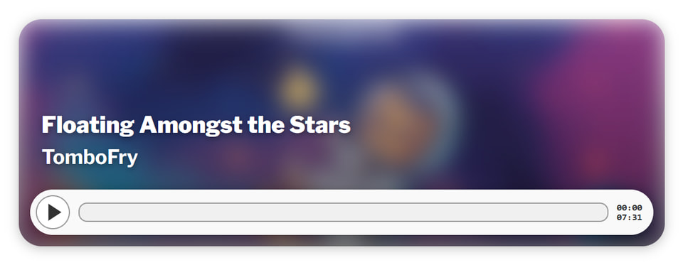
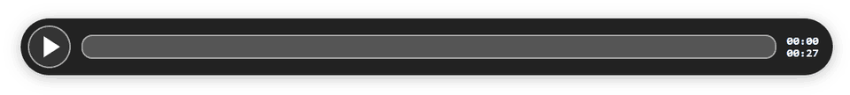
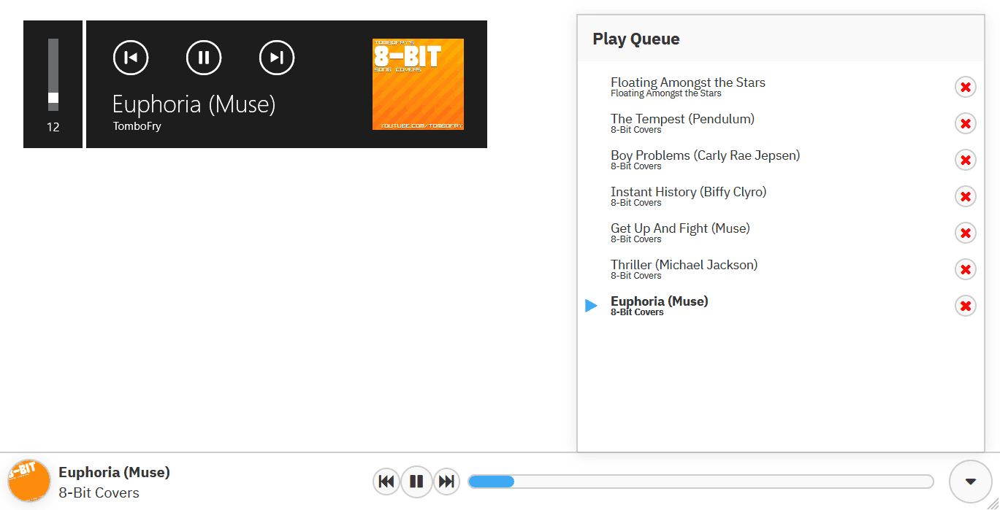

# Tombo's `<audio-player>` and `<web-player>` Web Components

For a demo of these components in action, visit my website where I've got them running right now: <https://www.tombofry.co.uk/post/2024-06-07-floating-amongst-the-stars>

## Simple Audio Player (`<audio-player>`)

A super-basic web component that wraps around the Audio API to make a nice
looking player with album art and simple metadata.

### Usage

First, add this script to whichever page you're adding a player to. It'll load
the web component.

```html
<script type="text/javascript" src="//tombofry.github.io/audio-player-component/audio-player-component.min.js" defer></script>
```

#### Default style

Then, use the web-component:

```html
<audio-player title="Floating Amongst the Stars" artist="TomboFry" sources="/song-url.opus,/song-url.caf" image="/image-url.jpg" min-height="500"></audio-player>
```



#### Compact

A compact player doesn't require anything except a list of sources:

```html
<audio-player sources="/song-url.mp3" compact dark></audio-player>
```



### Options

You can provide the following attributes to the audio player:

#### Useful Options

* `sources` (**required**) A comma-separated list of URLs containing one or more
  audio source for this player, in order of priority.
* `title` (optional) The audio track's title.
* `artist` (optional) The audio track's artist.
* `album` (optional) The audio track's album.
* `image` (optional) The image used on the player's background.
* `compact` (optional) If provided, this will remove the title, artist, album,
  and image, displaying **only** the controls.
* `colour` (optional) Changes the colour of the song progress background colour.
  Defaults to `#3FA9F5`.
* `dark` (optional) Changes the theme to dark mode.
* `blurred` (optional) If an image is provided, setting this to `false` will
  disable the blur. Enabled by default, unless you leave the `title` AND
  `artist` blank.

#### Niche/Technical Options

* `min-height` (optional) If you provide an image, this changes how tall the
  player can be. Defaults to `280` (pixels).
* `preload` (optional) The same as the regular preload option - one of: `none`,
  `metadata`, or `auto`.
* `length-secs` (optional) If you've set `preload` to `none`, and you know the
  length of the source you're providing, you can set this attribute to display
  the correct time before the metadata loads.

## Global Web Player (`<web-player>`)

A global persistent music player with a queue and proper `mediaSession` support
(provided your website is SPA-esque, and doesn't perform any full page loads).

This can be used in conjunction with `<audio-player>`: if the global player is
present, clicking play on an audio player will send the song to the global
player instead, and a plus icon will appear on the player, allowing you to add
to the queue as well.



### Usage

> [!IMPORTANT]
> Make sure [FontAwesome 4.7.0](https://fontawesome.com/v4/) is loaded, however
> you see fit: the UI icons rely on this. I know it's old, but the newer
> versions require accounts and payments, and I don't want the hassle.

Add this script and create the component at the end of your HTML body.

```html
<script type="text/javascript" src="//tombofry.github.io/audio-player-component/web-player/web-player.min.js" defer></script>

<web-player css="//tombofry.github.io/audio-player-component/web-player/web-player.min.css"></web-player>
```

Alternatively, you can host the JS/CSS files yourself, but make sure to specify
a link to the CSS file by using the `css` attribute. Just keep in mind that the minified CSS is not compatible with the non-minified JS, and vice versa.

(FWIW, I'm still trying to figure out a better way to include this, so the
styles are isolated within the component's shadowRoot)

### Queueing and Playing Songs

If you choose not to use the `audio-player` component above, `web-player`
exposes some functions you can use to queue/play songs, under
`window.TomboAudioPlayer`:

* `addToPlaylist({ title, artist, album, src, imageSrc })`
  * `title` (string)
  * `album` (string)
  * `artist` (string, optional)
  * `src` (string) URL to audio file
  * `imageSrc` (string) URL to image - cover art, thumbnail, etc.
* `addToPlaylistAndPlay({ title, artist, album, src, imageSrc })`
  * Uses the same properties as above
* `playPause()`
* `skipBack()`
* `skipForward()`

eg.

```js
window.TomboAudioPlayer.addToPlaylistAndPlay({
  title: 'Every Waking Moment',
  album: 'Floating Amongst the Stars',
  artist: 'TomboFry',
  src: '/path/to/audio.mp3',
  imageSrc: '/path/to/folder.jpg'
});
```
